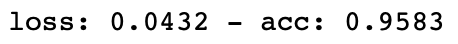

# sEMG_Based_Gesture_Recognition

Run
==
* cd sEMG_Based_Gesture_Recognition && python3 ./sEMG_Based_Gesture_Recognition.py

Alternatively

* Open with Anaconda Jupyter Notebook: https://www.anaconda.com/distribution/

Examples
==

